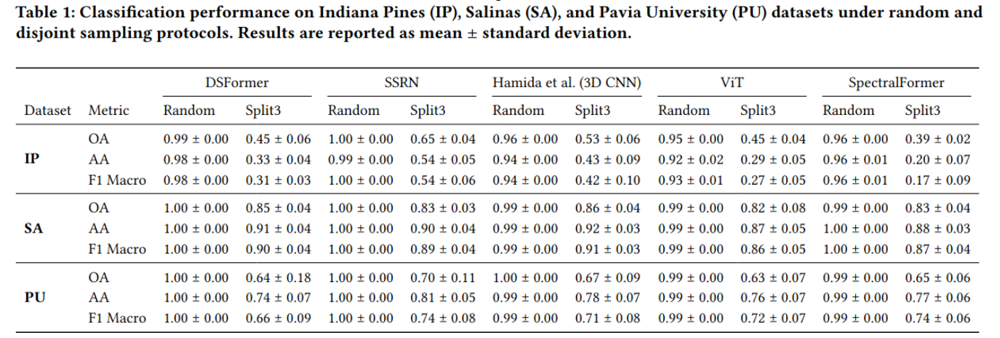
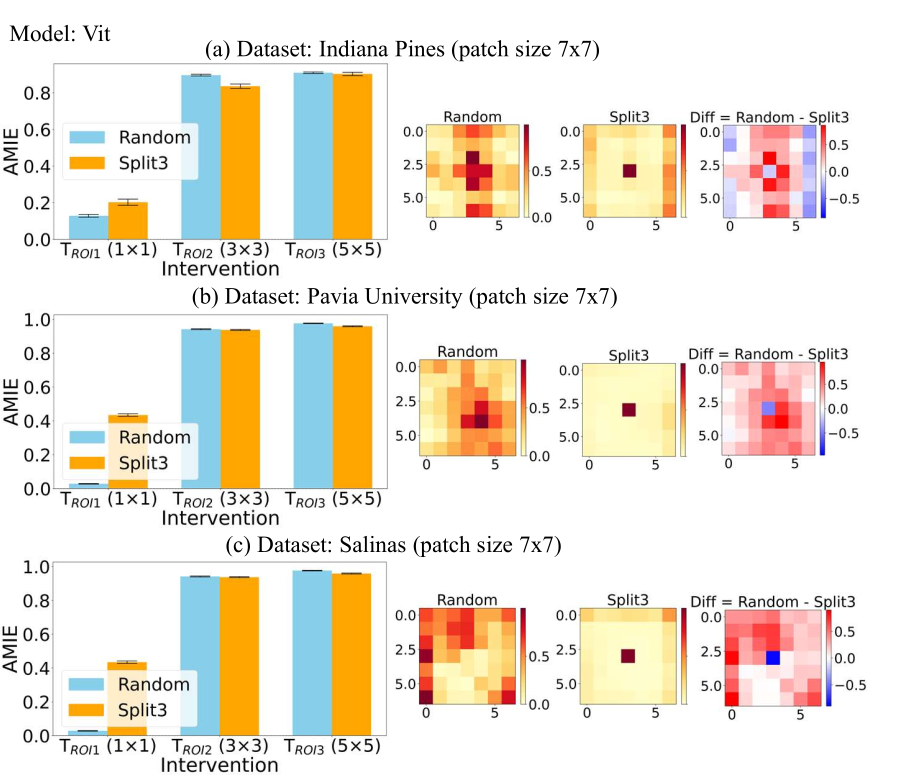

# ReX-HSIC 🛰️
**Rethinking HyperSpectral Image Classification (HSIC) Benchmark with Explainability (xAI) under a Causal Estimation Perspective**

> *Published in the Proceedings of the XAI4Science Workshop of the EDBT/ICDT 2026 (https://mlinardicyu.github.io/edbt_XAI4Science/) Joint Conference (March 24–27, 2026), Tampere, Finland.*

[](https://www.python.org/downloads/)
[](https://pytorch.org/)
[](LICENSE)

---

## 📌 Overview

Standard evaluation practices in patch-based Hyperspectral Image Classification (HSIC) rely on **pixel-wise random sampling**, which silently introduces spatial train-test leakage — inflating performance metrics by up to **+57%** and corrupting the causal structure learned by models.

This repository provides:
- **Split3** — a leakage-free data partitioning protocol that simultaneously addresses all 3 types of spatial leakage
- **AMIE** — an intervention-based causal sensitivity framework to quantify model reliance on the Region of Interest (ROI)
- **xAI attribution analysis** — Integrated Gradients heatmaps to expose spatial shortcuts induced by leakage

Experiments are conducted on 3 benchmark datasets across 5 state-of-the-art architectures (CNNs & Transformers).

---

## 🔍 The 3 Types of Spatial Leakage

| Type | Name | Description |
|------|------|-------------|
| T1 | **Spatial Proximity** | Train/test patches share nearly identical spatio-spectral content due to spatial closeness |
| T2 | **Contextual Leakage** | Even with disjoint splits, boundary patches still overlap at pixel level across sets |
| T3 | **Spatial Autocorrelation** | Nearby regions remain statistically correlated regardless of the sampling strategy used |

---

## 🗂️ Repository Structure

```
ReX-HSIC/
├── datasets/
│   ├── ip/
│   │   ├── Indian_pines_corrected.mat
│   │   └── Indian_pines_gt.mat
│   ├── pu/
│   │   ├── PaviaU.mat
│   │   └── PaviaU_gt.mat
│   └── sa/
│       ├── Salinas_corrected.mat
│       └── Salinas_gt.mat
├── models/                                   # Model architectures (SSRN, DSFormer, ViT, ...)
├── images/                                   # Result figures
├── trainer.py                                # Main training & evaluation script
├── main.py                                   # Entry point
├── run.sh                                    # Batch experiment launcher
├── compute_and_plot_amie_random_vs_split3.py # Causal AMIE analysis
├── attributions_heatmap.py                   # Integrated Gradients heatmaps
├── requirements.txt
└── README.md
```

---

## ⚙️ Setup

### 1. Create a virtual environment and install dependencies

```bash
python -m venv env
source env/bin/activate        # Linux / macOS
# env\Scripts\activate         # Windows

pip install -r requirements.txt
```

### 2. Download the datasets

Place the dataset files in the `datasets/` folder following the structure above. All datasets are publicly available:

| Dataset | Sensor | Size | Bands | Classes |
|---------|--------|------|-------|---------|
| Indian Pines (IP) | AVIRIS | 145×145 | 200 | 16 |
| Pavia University (PU) | ROSIS | 610×340 | 103 | 9 |
| Salinas (SA) | AVIRIS | 512×217 | 204 | 16 |

---

## 🚀 Running Experiments

### Option A — Batch launcher (all models, one dataset & strategy)

```bash
# Make the script executable
chmod +x run.sh

# Run
./run.sh ip split3
```
#### Key arguments

| Argument | Description | Options |
|----------|-------------|---------|
| `--dataset_name` | Target dataset | `ip`, `pu`, `sa` |
| `--split_strategy` | Data partitioning protocol | `random`, `split3` |


### Option B — Individual run

```bash
python trainer.py \
  --model_name=ssrn \
  --dataset_name=ip \
  --n_epochs=100 \
  --eval_step=1 \
  --lr=3e-4 \
  --patch_size=11 \
  --gpu_id=0 \
  --split_strategy=split3
```

#### Key arguments

| Argument | Description | Options |
|----------|-------------|---------|
| `--model_name` | Model architecture | `ssrn`, `dsformer`, `hamida`, `vit`, `spectralformer` |
| `--dataset_name` | Target dataset | `ip`, `pu`, `sa` |
| `--split_strategy` | Data partitioning protocol | `random`, `split3` |
| `--patch_size` | Spatial patch size (must be odd) | e.g. `7`, `11` |
| `--n_epochs` | Number of training epochs | e.g. `100` |
| `--lr` | Learning rate | e.g. `3e-4` |
| `--gpu_id` | GPU device index | `0`, `1`, ... |

---

## 📊 Results

5 models × 3 datasets (IP, PU, SA) · 4-fold CV · OA & Macro F1.



> Random sampling consistently overestimates generalization. The accuracy gap reaches **up to 57%** on Indian Pines (SpectralFormer).

---

## 🧠 Causal Analysis — AMIE & Attribution Heatmaps

For each trained model, we apply the **Average Model Intervention Effect (AMIE)** by zeroing out the Region of Interest (ROI) and measuring the resulting drop in predicted class probability:

```
AMIE(T_ROIi) = E[pθ(y | X)] − E[pθ(y | Ti(X))]
```

| AMIE value | Interpretation |
|------------|----------------|
| **High** | Model causally relies on ROI features ✅ |
| **Low / ≈ 0** | Model exploits contextual shortcuts outside the ROI ⚠️ |

Three intervention sizes: **ROI₀** (1×1) · **ROI₁** (3×3) · **ROI₂** (5×5).

Attribution maps are computed with **Integrated Gradients** and averaged across the test set to reveal the model's global spatial behavior under each protocol.



> Under **Split3**, attribution maps concentrate around the patch center (causal ROI). Under **random sampling**, they spread diffusely — a signature of shortcut learning.

---

## 🎓 Citation

Coming soon.

```bibtex
@inproceedings{rexhsic2026,
  title     = {Rethinking HyperSpectral Image Classification (HSIC) Benchmark
               with Explainability (xAI) under a Causal Estimation Perspective},
  author    = {yyy1 and yyy2 and xxx1},
  booktitle = {Proceedings of the Workshops of the EDBT/ICDT 2026 Joint Conference},
  year      = {2026},
  address   = {Tampere, Finland},
  doi       = {10.1145/nnnnnnn.nnnnnnn}
}
```

## 📞 Contact

- Sékou Dabo - dabo.sekou@cyu.fr
- Michele Linardi - michele.linardi@cyu.fr
- Claudia Paris - c.paris@utwente.nl

---
